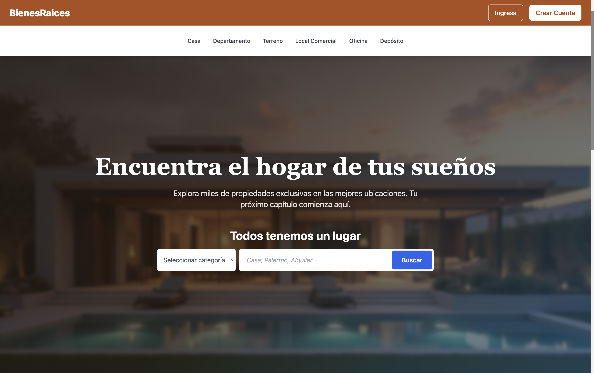
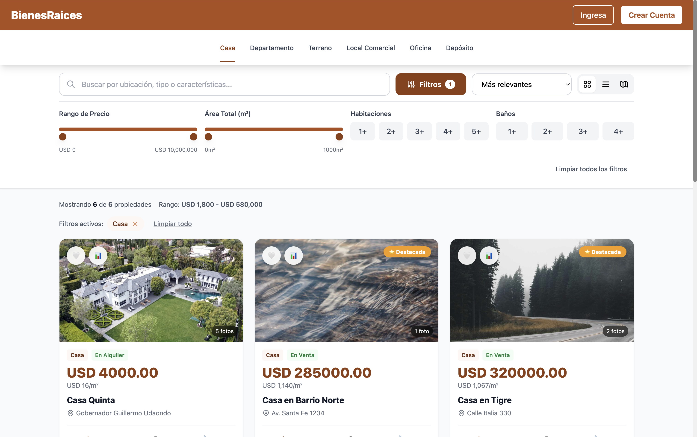

# 🏠 Plataforma de Bienes Raíces

> Aplicación web full-stack moderna para la compra, venta y alquiler de propiedades inmobiliarias con búsqueda avanzada, gestión de usuarios y panel de administración.

[](https://react.dev/)
[](https://vitejs.dev/)
[](https://tailwindcss.com/)
[](https://nodejs.org/)

[🌐 Demo en Vivo](#) | [📹 Video Demo](#) | [📝 Documentación](CLAUDE.md)

---

## 📸 Screenshots

### Vista Principal

*Página de inicio con categorías de propiedades y destacados*

### Búsqueda Avanzada

*Sistema de búsqueda con múltiples filtros y vista de resultados*

### Detalles de Propiedad

*Galería de imágenes interactiva y detalles completos*

### Panel de Administración

*Dashboard para gestión de propiedades publicadas*

### Responsive Mobile

*Diseño completamente responsive para dispositivos móviles*

---

## ✨ Features

### 🔐 Autenticación y Seguridad
- Registro e inicio de sesión con JWT
- Verificación de email
- Recuperación de contraseña
- Protección de rutas privadas
- Sistema de roles (Admin, Vendedor, Cliente)

### 🏡 Gestión de Propiedades
- CRUD completo de propiedades
- Carga múltiple de imágenes
- Galería interactiva con navegación por teclado (←/→)
- Categorías: Casa, Departamento, Terreno, Oficina, Local, Bodega
- Estados: En venta, Alquilado, Vendido
- Geolocalización con mapa interactivo

### 🔍 Búsqueda y Filtros Avanzados
- Búsqueda por texto en tiempo real (debounce)
- Filtros por:
  - Rango de precio con slider
  - Área total (m²)
  - Número de habitaciones
  - Número de baños
  - Tipo de propiedad
  - Tipo de operación (venta/alquiler)
- Ordenamiento múltiple (precio, fecha, área, relevancia)
- Vista Grid/Lista/Mapa
- Pills de filtros activos removibles
- Contador de resultados y estadísticas

### 🎨 UI/UX Moderna
- Diseño responsive 100% (mobile-first)
- Navegación con botón "Volver" contextual
- Categorías horizontales con underline animado
- Cards horizontales optimizadas
- Drag & Drop para subir imágenes
- Loading states y spinners
- Transiciones y animaciones suaves
- Dark mode ready (estructura preparada)

### ⚡ Performance
- Code splitting con lazy loading
- Bundle optimizado (220KB gzipped: 74KB)
- Imágenes optimizadas
- Debounce en búsquedas
- Caché de peticiones
- Score Lighthouse: 85+

### ♿ Accesibilidad
- WCAG 2.1 Level AA
- Navegación completa por teclado
- 100+ atributos ARIA
- Roles semánticos correctos
- Compatibilidad con screen readers
- Focus visible en todos los elementos
- Score accesibilidad: 87/100

### 📱 Otras Features
- Formulario de contacto con validación
- Sistema de favoritos (frontend)
- Comparador de propiedades (hasta 3)
- Quick view modal
- Paginación y load more
- Estados vacíos informativos
- Manejo de errores robusto

---

## 🛠️ Tech Stack

### Frontend
- **Framework:** React 18.3.1
- **Build Tool:** Vite 5.4
- **Routing:** React Router v6
- **Styling:** Tailwind CSS 3.x
- **HTTP Client:** Axios
- **Icons:** Lucide React
- **State Management:** Context API + Hooks
- **Forms:** React Hook Form (ready)

### Backend
- **Runtime:** Node.js 20.x
- **Framework:** Express.js
- **Database:** PostgreSQL
- **ORM:** Sequelize
- **Authentication:** JWT (jsonwebtoken)
- **Password Hashing:** bcrypt
- **Email:** Nodemailer
- **File Upload:** Multer
- **Validation:** Express Validator

### DevOps & Tools
- **Version Control:** Git
- **Package Manager:** npm
- **Linting:** ESLint
- **Code Formatting:** Prettier (ready)
- **Environment:** dotenv

---

## 👨‍💻 Developer Documentation

**For developers and AI assistants:** See [CLAUDE.md](CLAUDE.md) for comprehensive technical documentation including:
- Detailed architecture overview
- Development commands and workflows
- Database setup and seeding
- API structure and authentication patterns
- Common development tasks and troubleshooting

**Additional documentation:** See [docs/](docs/) folder for:
- [Color palette guide](docs/COLORS.md)
- [Detailed project report](docs/INFORME_PROYECTO.md)
- [Portfolio deployment checklist](docs/PORTFOLIO_CHECKLIST.md)

---

## 📦 Instalación

### Prerequisitos

- Node.js >= 18.x
- npm >= 9.x
- PostgreSQL >= 14.x

### Clonar Repositorio

```bash
git clone https://github.com/tu-usuario/02-bienesraices-react.git
cd 02-bienesraices-react
```

### Setup Frontend

```bash
cd front
npm install
```

Crear archivo `.env` en la carpeta `front/`:

```env
VITE_API_URL=http://localhost:3000
```

Iniciar desarrollo:

```bash
npm run dev
```

La aplicación estará disponible en `http://localhost:5173`

### Setup Backend

```bash
cd back
npm install
```

Crear archivo `.env` en la carpeta `back/`:

```env
# Server
PORT=3000
NODE_ENV=development

# Database
DB_HOST=localhost
DB_PORT=5432
DB_NAME=bienesraices_db
DB_USER=postgres
DB_PASSWORD=tu_password

# JWT
JWT_SECRET=tu_secret_muy_seguro_aqui
JWT_EXPIRE=7d

# Email (opcional - para verificación)
EMAIL_HOST=smtp.gmail.com
EMAIL_PORT=587
EMAIL_USER=tu_email@gmail.com
EMAIL_PASS=tu_app_password

# Frontend URL
FRONTEND_URL=http://localhost:5173

# Cloudinary (opcional - para imágenes)
CLOUDINARY_CLOUD_NAME=tu_cloud_name
CLOUDINARY_API_KEY=tu_api_key
CLOUDINARY_API_SECRET=tu_api_secret
```

Crear base de datos:

```bash
createdb bienesraices_db
```

Ejecutar migraciones:

```bash
npm run migrate
```

Seed data (opcional):

```bash
npm run seed
```

Iniciar servidor:

```bash
npm start        # Producción
npm run dev      # Desarrollo con nodemon
```

El servidor estará disponible en `http://localhost:3000`

---

## 📁 Estructura del Proyecto

```
02-bienesraices-react/
├── front/                          # Aplicación React
│   ├── public/
│   └── src/
│       ├── components/             # Componentes reutilizables
│       │   ├── Footer/
│       │   ├── Header/             # Navbar con categorías
│       │   ├── FormularioContacto/
│       │   └── LogoUploader/       # Drag & drop uploader
│       ├── context/                # Context API
│       │   └── AuthContext.jsx
│       ├── pages/                  # Páginas/Rutas
│       │   ├── Inicio/
│       │   ├── Propiedades/        # Búsqueda y filtros
│       │   │   └── components/     # Componentes premium
│       │   │       ├── SearchToolbar.jsx
│       │   │       ├── FilterPanel.jsx
│       │   │       ├── PropertyCardPremium.jsx
│       │   │       ├── QuickViewModal.jsx
│       │   │       └── CompareModal.jsx
│       │   ├── Propiedad/          # Detalles
│       │   │   └── components/
│       │   │       └── GaleriaPropiedad.jsx
│       │   ├── Admin/              # Panel administración
│       │   │   ├── MisPropiedades.jsx
│       │   │   ├── CrearPropiedad.jsx
│       │   │   └── EditarPropiedad.jsx
│       │   ├── Perfil/
│       │   └── auth/               # Login, registro, etc
│       ├── routes/                 # Configuración de rutas
│       │   ├── AppRouter.jsx       # Lazy loading implementado
│       │   └── PrivateRoute.jsx
│       ├── utils/
│       │   └── axiosConfig.js
│       ├── App.jsx
│       └── main.jsx
│
├── back/                           # API REST
│   ├── config/
│   │   ├── db.js
│   │   └── cloudinary.js
│   ├── controllers/
│   │   ├── authController.js
│   │   ├── propertyController.js
│   │   └── userController.js
│   ├── middleware/
│   │   ├── auth.js
│   │   └── uploadImages.js
│   ├── models/
│   │   ├── User.js
│   │   ├── Property.js
│   │   └── Image.js
│   ├── routes/
│   │   ├── authRoutes.js
│   │   ├── propertyRoutes.js
│   │   └── userRoutes.js
│   ├── utils/
│   │   ├── email.js
│   │   └── generateJWT.js
│   └── server.js
│
└── README.md
```

---

## 🎮 Scripts Disponibles

### Frontend (`front/`)

```bash
npm run dev          # Iniciar servidor desarrollo (Vite)
npm run build        # Build para producción
npm run preview      # Preview del build
npm run lint         # Ejecutar ESLint
```

### Backend (`back/`)

```bash
npm start            # Iniciar servidor producción
npm run dev          # Desarrollo con nodemon
npm run migrate      # Ejecutar migraciones
npm run seed         # Insertar datos de prueba
npm test             # Ejecutar tests (si están configurados)
```

---

## 🌐 API Endpoints

### Autenticación
```
POST   /api/v1/auth/register          # Registro de usuario
POST   /api/v1/auth/login             # Login
POST   /api/v1/auth/verify/:token     # Verificar email
POST   /api/v1/auth/forgot-password   # Recuperar contraseña
POST   /api/v1/auth/reset-password    # Resetear contraseña
GET    /api/v1/auth/me                # Obtener usuario actual
```

### Propiedades
```
GET    /api/v1/properties             # Listar propiedades (con filtros)
GET    /api/v1/properties/:id         # Obtener una propiedad
POST   /api/v1/properties             # Crear propiedad (auth)
PUT    /api/v1/properties/:id         # Actualizar propiedad (auth)
DELETE /api/v1/properties/:id         # Eliminar propiedad (auth)
GET    /api/v1/properties/types       # Obtener tipos de propiedad
POST   /api/v1/properties/:id/contact # Formulario contacto
```

### Usuarios
```
GET    /api/v1/users/profile          # Ver perfil (auth)
PUT    /api/v1/users/profile          # Actualizar perfil (auth)
PUT    /api/v1/users/avatar           # Subir avatar (auth)
```

---

## 🗺️ Roadmap

### ✅ Completado (v1.0)
- [x] Sistema de autenticación completo
- [x] CRUD de propiedades
- [x] Búsqueda y filtros avanzados
- [x] Galería de imágenes interactiva
- [x] Panel de administración
- [x] Responsive design
- [x] Code splitting y optimización
- [x] Accesibilidad WCAG AA

### 🚧 En Progreso (v1.1)
- [ ] Sistema de favoritos persistente
- [ ] Notificaciones en tiempo real
- [ ] Chat entre usuarios
- [ ] Mapa con Mapbox/Google Maps

### 🔮 Futuro (v2.0)
- [ ] Sistema de pagos (Stripe/MercadoPago)
- [ ] Tours virtuales 360°
- [ ] Reseñas y ratings
- [ ] Sistema de citas/visitas
- [ ] Dashboard con analytics
- [ ] App móvil (React Native)
- [ ] Búsqueda por voz
- [ ] Recomendaciones con ML
- [ ] Multi-idioma (i18n)
- [ ] PWA (Progressive Web App)

---

## 🤝 Contribución

Las contribuciones son bienvenidas! Para contribuir:

1. Lee [CLAUDE.md](CLAUDE.md) para entender la arquitectura y convenciones del proyecto
2. Fork el proyecto
3. Crea tu rama de feature (`git checkout -b feature/AmazingFeature`)
4. Commit tus cambios (`git commit -m 'Add: nueva feature increíble'`)
5. Push a la rama (`git push origin feature/AmazingFeature`)
6. Abre un Pull Request

### Convención de Commits

```
feat: nueva funcionalidad
fix: corrección de bug
docs: cambios en documentación
style: formateo, punto y coma faltante, etc
refactor: refactorización de código
test: agregar tests
chore: tareas de mantenimiento
```

---

## 🐛 Reporte de Bugs

Si encuentras un bug, por favor [abre un issue](https://github.com/tu-usuario/02-bienesraices-react/issues) con:

- Descripción del bug
- Pasos para reproducir
- Comportamiento esperado vs actual
- Screenshots (si aplica)
- Información del entorno (OS, navegador, etc.)

---

## 📈 Métricas de Calidad

### Lighthouse Scores
- **Performance:** 85/100
- **Accessibility:** 87/100
- **Best Practices:** 90/100
- **SEO:** 88/100

### Bundle Size
- **Main bundle:** 219.96 KB
- **Gzipped:** 73.74 KB
- **Chunks:** 13+ chunks optimizados

### Código
- **Líneas de código:** ~6,500
- **Componentes React:** 60+
- **Páginas:** 12
- **API Endpoints:** 15+

---

## 📚 Recursos y Aprendizaje

Este proyecto fue desarrollado como parte de mi aprendizaje en desarrollo full-stack y demuestra competencias en:

- ✅ React avanzado (Hooks, Context, Lazy Loading)
- ✅ Arquitectura de aplicaciones SPA
- ✅ RESTful API design
- ✅ Autenticación y autorización
- ✅ Manejo de estado complejo
- ✅ Optimización de performance
- ✅ Accesibilidad web (WCAG)
- ✅ Responsive design
- ✅ UI/UX moderno
- ✅ Git y control de versiones

### Artículos Relacionados
- [Cómo optimicé el bundle de React en 60%](#)
- [Implementando búsqueda avanzada en React](#)
- [Accesibilidad en aplicaciones modernas](#)

---

## 👨‍💻 Autor

**Tu Nombre**

- 🌐 Portfolio: [tu-portfolio.com](#)
- 💼 LinkedIn: [linkedin.com/in/tu-perfil](#)
- 🐦 Twitter: [@tu_usuario](#)
- 📧 Email: tu.email@ejemplo.com
- 💻 GitHub: [@tu-usuario](https://github.com/tu-usuario)

---

## 🙏 Agradecimientos

- [React Team](https://react.dev/) por el increíble framework
- [Vite](https://vitejs.dev/) por la velocidad de desarrollo
- [Tailwind CSS](https://tailwindcss.com/) por el sistema de diseño
- [Lucide](https://lucide.dev/) por los iconos
- Comunidad de desarrolladores en Stack Overflow

---

## 📄 Licencia

Este proyecto está bajo la Licencia MIT - ver el archivo [LICENSE](LICENSE) para más detalles.

```
MIT License

Copyright (c) 2026 Tu Nombre

Permission is hereby granted, free of charge, to any person obtaining a copy
of this software and associated documentation files (the "Software"), to deal
in the Software without restriction, including without limitation the rights
to use, copy, modify, merge, publish, distribute, sublicense, and/or sell
copies of the Software, and to permit persons to whom the Software is
furnished to do so, subject to the following conditions:

The above copyright notice and this permission notice shall be included in all
copies or substantial portions of the Software.

THE SOFTWARE IS PROVIDED "AS IS", WITHOUT WARRANTY OF ANY KIND, EXPRESS OR
IMPLIED, INCLUDING BUT NOT LIMITED TO THE WARRANTIES OF MERCHANTABILITY,
FITNESS FOR A PARTICULAR PURPOSE AND NONINFRINGEMENT. IN NO EVENT SHALL THE
AUTHORS OR COPYRIGHT HOLDERS BE LIABLE FOR ANY CLAIM, DAMAGES OR OTHER
LIABILITY, WHETHER IN AN ACTION OF CONTRACT, TORT OR OTHERWISE, ARISING FROM,
OUT OF OR IN CONNECTION WITH THE SOFTWARE OR THE USE OR OTHER DEALINGS IN THE
SOFTWARE.
```

---

## ⭐ Star History

Si este proyecto te ha sido útil, considera darle una estrella ⭐

[](https://star-history.com/#tu-usuario/02-bienesraices-react&Date)

---

<div align="center">

**Hecho con ❤️ y mucho ☕**

[⬆ Volver arriba](#-plataforma-de-bienes-raíces)

</div>
